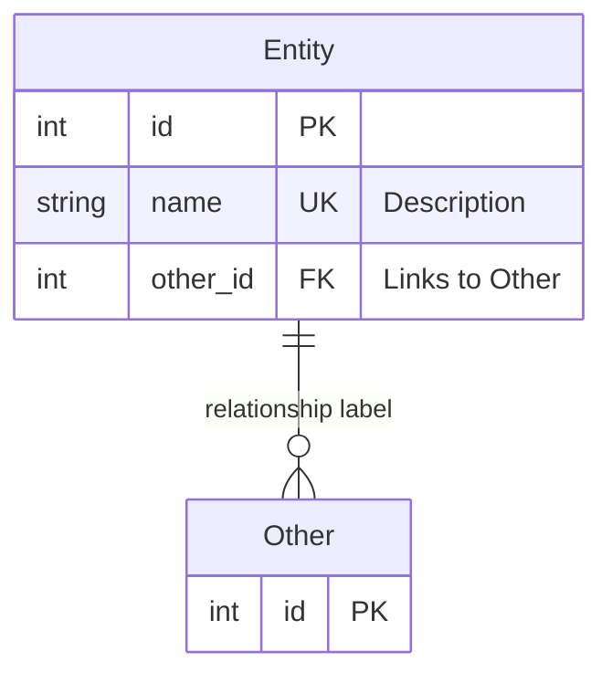

---
{
  "title": "diagramming-codebase",
  "description": "Explores a Python codebase and creates Mermaid architecture and data model diagrams with prose documentation. Use when asked to diagram, map, visualize, or document a codebase's structure, architecture, or data model.",
  "license": "MIT",
  "usage_notes": "",
  "tags": [],
  "active_version": 1
}
---

---
name: diagramming-codebase
description: "Explores a Python codebase and creates Mermaid architecture and data model diagrams with prose documentation. Use when asked to diagram, map, visualize, or document a codebase's structure, architecture, or data model."
---

# Codebase Diagramming

Creates architecture overview and data model (ER) diagrams for Python codebases, with prose documentation in Markdown files and optionally in Jupyter notebooks.

## Default Behavior

If the user mentions this skill without specifying a project, **automatically diagram the current workspace** without asking for confirmation. Use the workspace root directory as the base for exploration.

## Workflow

### Phase 1: Explore the Codebase

1. Read top-level files: `README.md`, `pyproject.toml` / `setup.cfg` / `setup.py`, any PRD/design docs
2. List the main package directory to find all modules
3. Read every module file to understand:
   - What it does (implemented vs. stub/placeholder)
   - Its imports (dependencies on other modules)
   - Key classes and functions
   - Database models / dataclasses if any
4. Identify the entry point(s): `main.py`, `app.py`, CLI scripts, etc.
5. Check for frameworks: FastAPI, Flask, FastHTML, Django, etc.

### Phase 2: Classify Module Status

For each module, assign a status:
- 🟢 **Done**: Substantially implemented with real logic
- 🟡 **Partial/Broken**: Partially implemented, has TODOs, broken imports, or incomplete functions
- 🔴 **Stub**: Only placeholder code (e.g., `pass`, `foo()`, empty classes)

### Phase 3: Create the Architecture Diagram

Create a **flowchart TB** (top-to-bottom) Mermaid diagram showing:

- **External systems** at the top (databases, APIs, file systems, vaults)
- **Layers as subgraphs**: group modules by their role (ingestion, storage, domain logic, web/API, entry points)
- **Data flow edges**: arrows showing how data moves through the system
- **Color-coded status** using `classDef`:

```mermaid
classDef done fill:#1a5c1a,stroke:#2ecc71,color:#fff
classDef partial fill:#7d5a00,stroke:#f39c12,color:#fff
classDef stub fill:#7a1a1a,stroke:#e74c3c,color:#fff
classDef ext fill:#1a3a5c,stroke:#3498db,color:#fff
```

Guidelines:
- Show module-level boxes, not individual functions (unless a module has a critical broken piece worth highlighting)
- Label edges with what flows through them (e.g., "parse markdown", "upsert records", "query")
- Keep it to 5-8 subgraphs maximum for readability
- Include a legend: `**Legend**: 🟢 Done | 🟡 Partial/Broken | 🔴 Stub/Not Started | 🔵 External`

### Phase 4: Create the Data Model Diagram (if applicable)

If the project has database models, dataclasses, or Pydantic models, create an **erDiagram**:



Guidelines:
- Include all model classes, even stubs (mark them with a note)
- Show PK, FK, UK annotations
- Add field descriptions as quoted strings
- Show all relationships with correct cardinality (||--o{, ||--||, }o--o{)
- Note any relationships that are described in docs but not yet implemented in code

### Phase 5: Write Documentation

Create a `docs_md/` directory (or use an existing docs directory) with markdown files:

#### `docs_md/architecture.md`
Structure:
1. **Title + one-line description**
2. **Introduction**: What the project is, what framework/approach it uses
3. **System Architecture**: The mermaid diagram (using ` ```mermaid ` syntax for GitHub)
4. **Layer Details**: Prose explanation of each layer/subgraph, listing key modules and their status
5. **Module Status Summary**: Table with columns: Module | Status | Notes
6. **Key Issues**: Numbered list of bugs, broken imports, inconsistencies found
7. **Recommended Next Steps**: Prioritized action items

#### `docs_md/datamodel.md`
Structure:
1. **Title + one-line description**
2. **Introduction**: What database/ORM is used, how models are defined
3. **Entity Relationship Diagram**: The mermaid ER diagram
4. **Entity Descriptions**: Prose for each entity explaining its purpose and key fields
5. **Relationships**: Tables showing implemented and planned relationships
6. **Known Issues**: Missing models, inconsistent APIs, schema gaps

Use ` ```mermaid ` (no curly braces) in the markdown files so they render on GitHub.

### Phase 6 (Optional): Create Jupyter Notebooks

If the project uses Jupyter notebooks (nbdev, scientific Python, data projects), create notebooks that:

1. Contain all prose in **markdown cells**
2. Contain mermaid diagrams in markdown cells using ` ```{mermaid} ` syntax (quarto-compatible)
3. Have a **final code cell** that reads the notebook's own markdown cells and writes to `docs_md/`:

```python
import json
from pathlib import Path

NB_PATH = Path("20_Architecture.ipynb")  # This notebook's filename
OUTPUT_DIR = Path("../docs_md")
OUTPUT_DIR.mkdir(exist_ok=True)

with open(NB_PATH) as f:
    nb = json.load(f)

md_cells = []
for cell in nb["cells"]:
    if cell["cell_type"] != "markdown":
        continue
    content = "".join(cell["source"])
    if "Sync: Generate Markdown File" in content:
        break
    md_cells.append(content)

content = "\n\n".join(md_cells)
content = content.replace("```{mermaid}", "```mermaid")

output_path = OUTPUT_DIR / "architecture.md"
output_path.write_text(content)
print(f"Written to {output_path.resolve()}")
```

This keeps notebooks and markdown files in sync: notebooks are the source of truth, running them regenerates the markdown.

## Output Checklist

- [ ] `docs_md/architecture.md` with flowchart diagram + prose
- [ ] `docs_md/datamodel.md` with ER diagram + prose (if data models exist)
- [ ] Mermaid diagrams rendered inline for the user (using the mermaid tool)
- [ ] Jupyter notebooks (only if the project already uses notebooks)

## Tips

- Always read actual module files before diagramming — never guess from filenames alone
- Check for broken imports by looking at `from .module import ...` statements and verifying the referenced modules exist
- Look for mixed API patterns (e.g., some modules using an ORM, others using raw SQL) — these are common issues worth highlighting
- Check if referenced database tables have corresponding model definitions
- Note any `TODO`, `FIXME`, or `HACK` comments as issues
